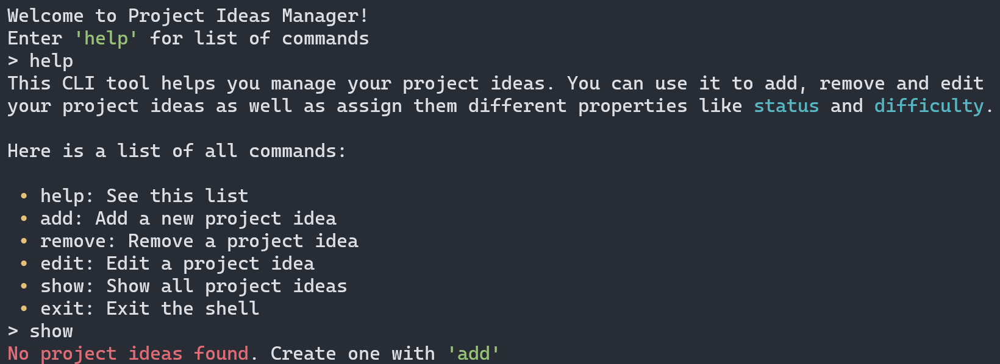

  

<h1 align="center">Менеджер ідей для проєктів</h1>

### Зміст

- [Зміст](#зміст)
- [Огляд](#огляд)
- [Встановлення та використання](#встановлення-та-використання)
- [Скріншоти](#скріншоти)
- [Посилання](#посилання)
- [Ліцензія](#ліцензія)

### Огляд

Менеджер ідей для проєктів - це простий, але потужний CLI-інструмент для керування особистими ідеями для ваших проєктів. Він дозволяє легко додавати та змінювати елементи за допомогою бази даних SQLite, а також має інтуїтивно зрозумілий та самодокументований користувацький інтерфейс за допомогою модуля Python Click.

### Встановлення та використання

- Завантажте [останню версію](https://github.com/seesmof/project-ideas-manager-cli/archive/refs/tags/v1.0.1.zip) з GitHub
  - Переконайтеся, що на вашій системі встановлено Python 3.10 або новішої версії. Якщо ні, будь ласка, зробіть це спочатку - [остання версія](https://www.python.org/downloads/)
- Розархівуйте архів у будь-яку директорію, куди ви хочете, щоб додаток був встановлений
- Запустіть за допомогою файлу `Run.bat`.
- Насолоджуйтесь!

### Скріншоти

### Посилання

- [Іконка](https://www.flaticon.com/)

### Ліцензія

Цей проект ліцензовано згідно з [Ліцензією MIT](../LICENSE).

<a href="#readme-top"><strong>Back to top</strong></a>

